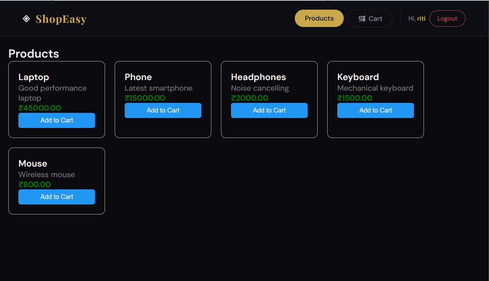
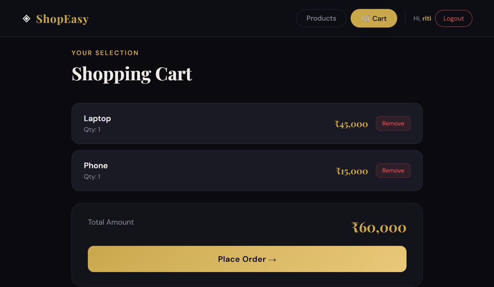

# 🛒 ShopEasy - Full Stack E-Commerce App

A full-stack e-commerce web application built with React.js, Node.js, Express, and MySQL.

## 🚀 Features
- User Registration and Login with JWT Authentication
- Browse Products
- Add to Cart / Remove from Cart
- Cart Total Calculation
- Secure Password Hashing with bcrypt
- RESTful API Backend

## 🛠️ Tech Stack

**Frontend:**
- React.js
- Axios
- CSS3

**Backend:**
- Node.js
- Express.js
- MySQL2
- JWT (JSON Web Tokens)
- bcryptjs

**Database:**
- MySQL

## 📁 Project Structure
```
shopeasy/
├── backend/
│   ├── index.js
│   └── .env
└── frontend/
    └── src/
        ├── App.js
        └── pages/
            ├── Login.js
            ├── Products.js
            └── Cart.js
```

## ⚙️ Setup Instructions

### Backend
```bash
cd backend
npm install
node index.js
```

### Frontend
```bash
cd frontend
npm install
npm start
```

### Environment Variables (.env)
```
DB_HOST=localhost
DB_USER=root
DB_PASSWORD=yourpassword
DB_NAME=ecommerce
JWT_SECRET=mysecretkey123
PORT=5000
```


> Login Page | Products Page | Cart Page

Products Page


Cart Page


## 👩‍💻 Author
**Riti Verma** — B.Tech CSE, KIIT University

